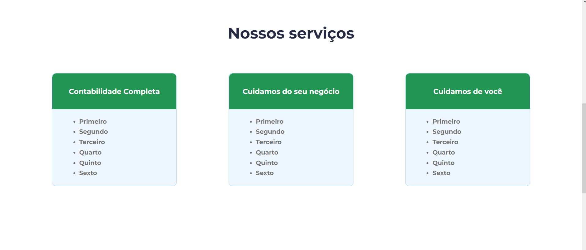
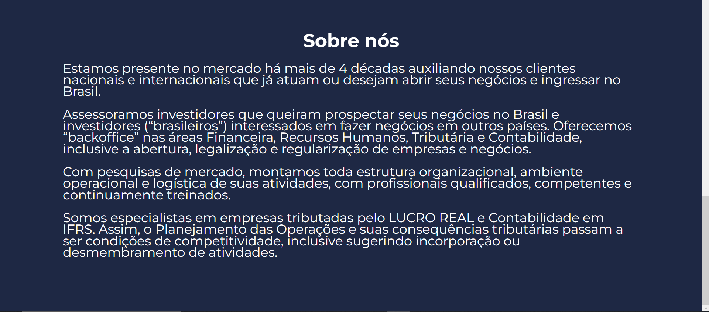

# Clone of my WhatsApp profile





> Introduction images to the layout of the Accounting website.


<br>
[Link do projeto](https://donsburger.netlify.app) - Project developed with HTML, CSS and JavaScript for accounting firm (Desktop version).

## 🤝 Contributors.

We thank the following people who contributed to this project:

<table>
  <tr>
    <td align="center">
      <a href="#">
        <br>
        <sub>
          <b>Guilherme Raposo</b>
        </sub>
      </a>
    </td>
  </tr>
</table>
<br>
<br>
## Project setup
```
npm install
```

### Compiles and hot-reloads for development
```
npm run serve
```

### Compiles and minifies for production
```
npm run build
```

### Lints and fixes files
```
npm run lint
```
